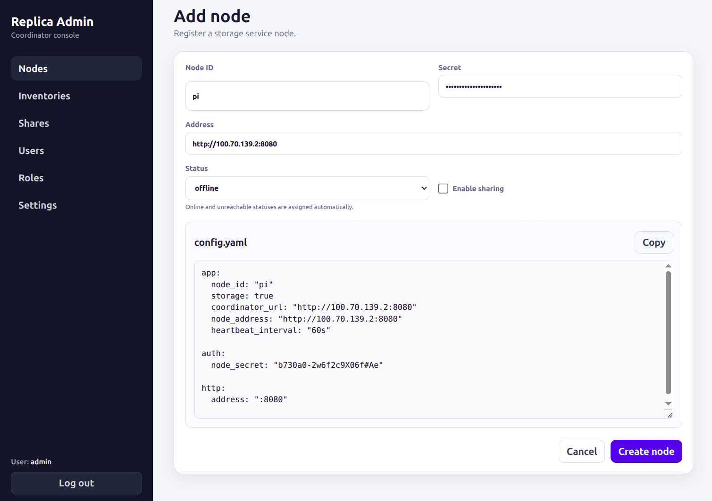

# Replica

A distributed, self-hosted file sharing and file replication service made with `Go + Huma + GORM`.

While the initial idea for the service is to facilitate storage, backup and sharing of my own photo collection,
it is not limited to specific data type:  
storage and replication functionality should be agnostic to data type and
frontend is intended to be extensible to present different file types (images, audio, video, documents ...)

## [Detailed description](docs/application.md)
## [API specification](docs/api.md)
## Installation and configuration
Setup of the replica service consists of thr following steps:
1. Build or get binary
2. Configure coordinator
3. Init coordinator database
4. Run coordinator
5. Register additional storage nodes in thr coordinator admin interface
6. Configure additional storage nodes
7. Run additional storage nodes


### 1. Build
Requirements:  
go 1.25.0 or newer.

To build the service, use the build script:
```bash
# Detect the current Linux architecture
./build.sh

# Build specific target
./build.sh linux-amd64
./build.sh linux-arm64
./build.sh linux-armv7
./build.sh windows-amd64

# Build every target
./build.sh all
```
Output will be structured as:
```
bin/
├── linux-amd64/
│   ├── replica
│   └── replica-seed
├── linux-arm64/
│   ├── replica
│   └── replica-seed
├── linux-armv7/
│   ├── replica
│   └── replica-seed
└── windows-amd64/
    ├── replica.exe
    └── replica-seed.exe
```

### 2. Configure coordinator
Each setup must have one coordinator that holds the application state and any number of storage nodes.  

```bash
cp config_sample.yaml config.yaml
```
Minimum coordinator + storage node config:
```yaml
app:
  node_id: coordinator
  coordinator: true
  storage: true
  coordinator_url: "http://coordinator:8080"
  node_address: "http://coordinator:8081"

auth:
  jwt_secret: "Af59X28#57"
  node_secret: "8812d%1H3da87fc7&1af*R90eaf59n"

http:
  address: ":8080"

database:
  driver: "sqlite"
  dsn: "replica.db"

seed:
  admin_name: admin
  admin_password: "Af59X28#57"
```

[Detailed configuration options](docs/config.md)

### 3. Init coordinator database
```bash
./replica-seed
```

### 4. Run coordinator
```bash
./replica
```
This will run application from console , which is ok for testing avd verification if configuration is ok, 
but for permanent deployment use one of the methods described in [Run section](#run).

### 5. Register storage node
1. Open "Add node" interface in the admin panel:

2. Enter node info
3. Copy node configuration and sac it to the `config.yaml` file
4. Click "Create node"

### 6. Configure storage node
Copy `config.yaml` file from the previous step to the server on which storage node will run.  
If needed, adjust `app.coordinator_url` so that storge node can connect to the coordinator.

### 7. Run storage node
Run service with one of the methods described in [Run section](#run).  
For storage node, no database initialization step is needed.

## Run
### From code
For development, database initialization and the service can be run directly from code:  
```bash
# initialize database
go run cmd/seed/main.go
# run the service
go run cmd/api/main.g
```
### As a systemd service
1. Place compiled binary and configuration file in `/opt/replica`. 
  For a storge node, or a coordinator with postgres database, this folder and its content can be read-only, for coordinator with sqlite, it needs permissions to create and write database file.

2. Create systemd unit file `/etc/systemd/system/replica.service` with the following content:
```
[Unit]
Description=Replica Service
After=network.target

[Service]
Type=simple
User=replica
WorkingDirectory=/opt/replica
ExecStart=/opt/replica/replica
Restart=on-failure
RestartSec=5s

# Standard output and error logging managed by journald
StandardOutput=journal
StandardError=journal
SyslogIdentifier=replica

[Install]
WantedBy=multi-user.target
```
Replace `User=replica` with whatever user will be used to run the service. It could be root, but using any regular user 
is sufficient and safer.
After that the service can be started/stopped/restarted with systemctl like: `systemctl restart replica.service`

### With docker compose
`docker-compose.yml` expects prebuilt Linux binaries and starts the service from environment variables or `.env` file 
instead of `config.yaml`.

Run database initialization:
```bash
docker compose --profile tools run --rm init-db
```

Start PostgreSQL and the coordinator:
```bash
docker compose up
```

## Exposing shares
TODO
