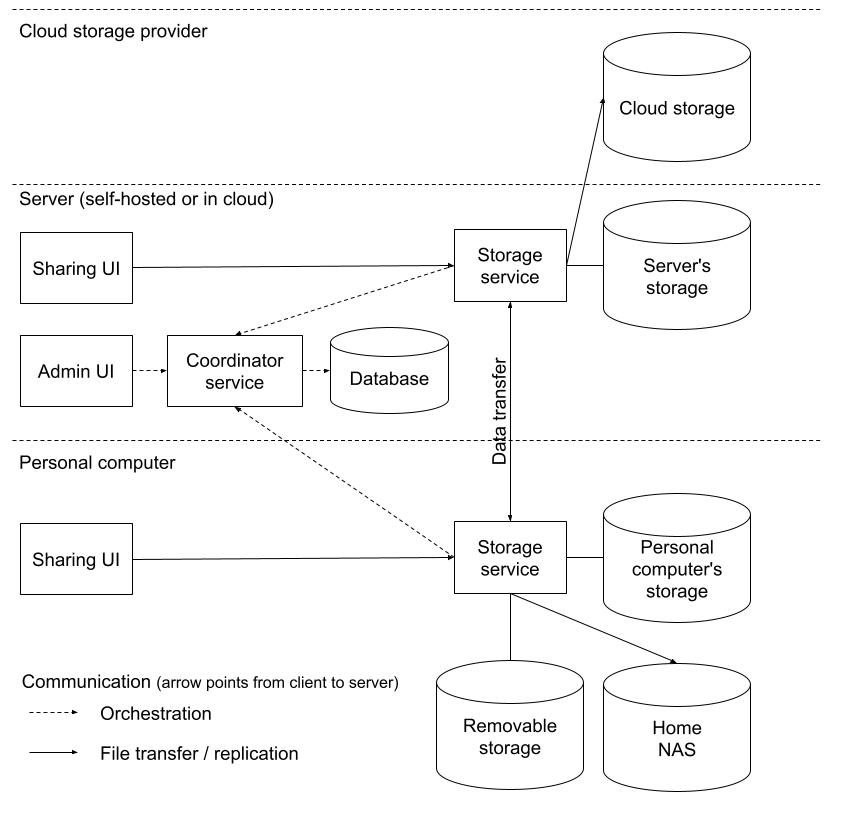
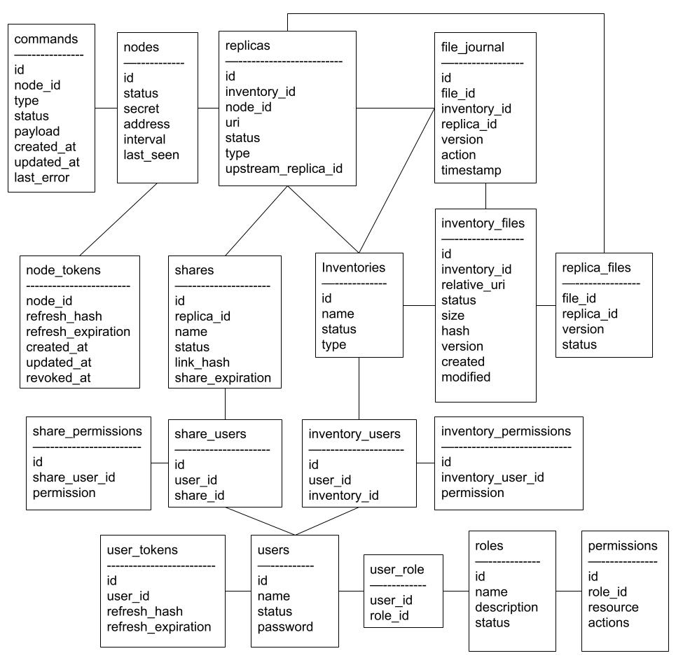

# Replica service

A distributed, self-hosted file sharing and file replication service.  
While the initial idea for the service is to facilitate storage, backup and sharing of my own photo collection, 
it is not limited to specific data type: storage and replication functionality should be agnostic to data type and 
frontend is intended to be extensible to present different file types (images, audio, video, documents ...)

These are the main functionalities that the service offers:

* File sharing through the web interface  
* File replication trough rules

## Key concepts

### Inventory
Inventory entry is either a selected set of files or a folder holding a collection of files and folders (i.e. photos).

Inventory can have replication rules, sharing rules, ownership and permissions.  

Inventory can be created either for replication and/or for sharing but neither is mandatory on an inventory.

Inventories can overlap: a file or folder can be part of multiple inventories with different replication rules, 
shares and permissions.

### Replica
Each inventory has at least one replica which points to the physical location of data.  

Replica can be defined on local computer storage, cloud storage (i.e. aws s3, with ability to add support for more 
storage types) and removable storage, like external disk occasionally plugged into the computer to receive data backup.

An inventory can have multiple replicas with the following replication rules:
* Base replicas have `upstream_replica_id = null` and participate in multi-directional replication with other base 
  replicas of the same inventory.
* Downstream replicas have `upstream_replica_id` set to another replica in the same inventory and receive changes 
  from that upstream replica.
* Local changes reported from downstream replicas are not authoritative inventory changes. Known inventory files are
  marked pending and restored from the upstream replica without changing inventory versions or file journal entries.
  Unknown local files are deleted from the downstream replica.
* One-way replication replicas can form a tree structure where any downstream replica can have only one source.

### Share
It's a replica accessible through the API and web interface with special permissions allowing 
authenticated or anonymous users to read or update files based on per-share permissions.  

Share API and web interface are exposed on the same node on which replica exists.  

In case of conflicting permissions and rules (i.e. writeable share for read-only replica) it's up to the API to 
detect conflicting settings and display an error.  

### Users, ownership and permissions
Users can be authenticated or anonymous. Inventory and share can have one or more users and each user can have a list 
of actions allowed to perform for an inventory or share.

Replicas do not have explicit user's permissions - what can be done to an replica depends on an inventory permissions 
and replica type

### Key architectural principles
1. Coordinator database is the source of truth.
2. Storage services never persist authoritative state.
3. Node communication is coordinator-centric.
4. Nodes initiate all coordinator communication.
5. Replication is orchestrated by coordinator.
6. Data integrity has priority over availability.

## Deployment model
Even though this is a distributed service that works with the distributed data, the main design goal is data integrity 
over availability, so it requires a designated coordinator node that holds the system state.  
All other nodes need the coordinator to be online and available for service to work.

## System components


### Coordinator service + database + API + admin UI
There is only one coordinator service main database holding system state and exposing 
[public API](api.md#public-api) for administration and [internal API](api.md#internal-api) for node coordination.

### Storage service + file transfer API
Part of the system that handles replica(s) on the filesystem or cloud storage. 
Each replica is handled by one storage service. Even in the case of cloud storage like s3, there is one storage service 
responsible for the replica. One storage service instance can manage multiple replicas on multiple locations.  
Storage service must have sufficient permissions and credentials to manage its replicas and must return appropriate 
error in case of permissions and/or credential problems.  
To avoid a split state scenario, the storage service will have no persisted state: it will authenticate with the 
coordinator, and then retrieve the state from the coordinator.
IT will periodically scan replicas and report changes to the coordinator, and ask for instructions on how to proceed. 
In case of the unavailable coordinator, it should halt all replication until the coordinator becomes available again.  
Storage service also exposes file transfer API for direct node-to-node file replication.  
  
### Sharing service + sharing UI
Sharing service is both a web app with UI with data presentation (previews for images, links for documents etc) and 
interface for data upload / replace / delete if share permissions allow it.  
The sharing service uses the coordinator to resolve which replica to use and can even use local read-only replica for 
fast read and remote updateable replica for update.

## Database



### Tables and fields descriptions

#### nodes
status - online, unreachable, offline, disabled, revoked
secret - hashed secret for node to coordinator authentication 
address - node address reported to the coordinator
interval - heartbeat interval reported by the node, in seconds
last_seen - last time the node reported to the coordinator

#### inventories
name - if not specified, will use folder or file name  
status - active, deleted  
type - file, folder

#### inventory_files
relative_uri - file uri from the replica root. replica uri + relative_uri make full file path  
version - file version used for synchronization between replicas, if inventory version is above replica versions file in the replica needs to be synchronized  
status - active, deleted  

#### file_journal
action - crud action: created, updated, modified, deleted, restored  
replica_id - replica on which action occurred  
version - version on which action has been performed (old version)  
timestamp - action timestamp  
replica_id - replica on which action occurred  

#### replicas
node_id - id of the service node on which replica exists  
uri - data prefix uri for the replica; full file paths are formed from replica `uri` plus `inventory_files.relative_uri`
status - active, deleted  
type - storage, filesystem, removable
upstream_replica_id - nullable reference to another replica in the same inventory; null means base multi-directional replica, non-null means downstream/read-only from replication perspective

#### replica_files
version - last file version in the replica  
status - changed, pending, synchronized, conflict, error:  
 -changed - local change that needs to be propagated in the case of multi-directional replication or overridden in case of read-only replication  
 -pending - waiting for remote changes to be applied to the local copy  
 -synchronized - all changes reconciled, nothing to do  
 -conflict - multiple changes detected, requires manual fix  
 -error - problems other than conflict, for example permission problem

#### shares
name - if not specified, will use inventory name  
status - active, deleted  
link_hash - optional link hash  
share_expiration - optional share expiration  

#### users
name - username or email    
status - active, deleted  

#### roles
status - active, deleted

#### permissions
resource - users, shares, inventories (permissions to manage inventories implies permission to manage replicas)
action - read, create, update delete

#### settings
key - application-managed setting key
value - application-managed setting value

## Operation
### Communication between nodes

All node communication is coordinator-centric.  
Storage nodes do not directly coordinate replication state between themselves.  
The coordinator is the authoritative source of inventory state, replica state and replication decisions.

Storage nodes initiate all coordinator communication themselves, which allows nodes to operate behind NAT or private networks without requiring inbound connectivity from the coordinator.

#### Node startup
When a storage service starts, it:
1. Reads coordinator URL, node ID and node secret from configuration
2. Authenticates against the coordinator internal API
3. Retrieves assigned replicas and required runtime state from the coordinator
4. Starts monitoring local replicas
5. Establishes a WebSocket connection to the coordinator
6. Starts sending periodic heartbeat requests

The storage service does not persist authoritative replication state locally.  
After restart, all required runtime state is rebuilt from the coordinator.

Storage services track active watcher state by replica ID in volatile runtime state. A `scan_replica` command starts
the replica watcher when one is not already running, allowing newly-created replica assignments to be monitored
without restarting the storage service. Every replica creation or update creates a durable `refresh_state` command
for the responsible storage node. After refreshing its assignments, the storage service stops watchers for replicas
whose current status is `deleted`.

#### Heartbeat
Storage services periodically report heartbeat information to the coordinator using 
[/nodes endpoint of the internal API](api.md#nodes-endpoint-1)

The coordinator updates node runtime state such as:
- last_seen
- current node address
- heartbeat interval
- online, unreachable or offline status

The coordinator checks node status every five seconds and when WebSocket connections open or close:
- an active WebSocket connection makes the node `online`
- without an active WebSocket connection, a heartbeat no older than twice the reported interval makes the node `unreachable`
- without an active WebSocket connection, an older heartbeat or missing heartbeat data makes the node `offline`
- `disabled` and `revoked` nodes are not changed automatically

Heartbeat response can also contain pending orchestration tasks.

The tasks field acts as a fallback delivery mechanism when the WebSocket connection is unavailable.

After updating the checking-in node state, the coordinator checks active replicas assigned to that node. If a replica
has pending `replica_files` and no pending `reconcile_replica` command for that destination replica, the coordinator
creates a new reconcile command. Failed, completed and canceled commands do not block creation.

#### WebSocket orchestration channel
After authentication, the storage service establishes a WebSocket connection to the coordinator.

The WebSocket connection is initiated by the storage service, so it can be maintained even when the node is behind NAT.
The coordinator considers a node online while at least one WebSocket connection for that node is active.

The coordinator uses the WebSocket to send command to the storage service, such as:

- start replica scan
- refresh replica state
- start replication task
- cancel replication task
- request detailed status

Data from storage node to the coordinator, such as:

- heartbeat
- replica scan results
- local replica file change reports
- task progress
- task completion

Continues to use the HTTP API.

#### Replica change reporting
Storage services periodically scan assigned replicas.

When local file changes are detected, the storage service reports:
- file path
- operation type
- BLAKE3 content hash
- size
- modification timestamp
to the coordinator.

The coordinator validates the reported change, updates authoritative inventory state and determines whether 
replication actions are required on other replicas.

For a multi-directional replica (`upstream_replica_id = null`), local changes are authoritative only for files where 
that replica is already synchronized to the current inventory version. 
A replica file with `pending`, `changed`, `conflict` or `error` status, or with an older version, is not allowed to 
change authoritative inventory state for that file. 
This prevents a newly-created multidirectional replica from reporting missing files as deletes before its initial 
reconciliation has completed.

For a downstream replica (`upstream_replica_id != null`), reported local changes never update `inventory_files` or
`file_journal`. Changes to known active inventory files mark only the reporting `replica_files` rows as `pending` and
create a `reconcile_replica` command sourced from the configured upstream. Unknown paths, including paths that only
match deleted inventory files, are included in the command for deletion from the downstream replica. Downstream
replicas are also scanned on storage-service startup so local changes made while the service was stopped are repaired.
 
Storage services do not independently decide global synchronization state.  

#### Data transfer between nodes
The coordinator orchestrates replication, but actual file transfer is performed between storage services.

When replica B requires a newer file version from replica A:
1. Replica A reports updated file state to coordinator
2. Coordinator updates authoritative inventory state
3. Coordinator marks replica B as pending
4. Coordinator assigns replication task to replica B
5. Replica B retrieves file data from replica A or another synchronized replica
6. Replica B verifies transferred file hash and size
7. Replica B reports successful synchronization to coordinator

Depending on deployment topology, file transfer can happen:
- directly between storage node
- through VPN or overlay network such as Tailscale or ZeroTier
- through temporary relay or shared storage

The coordinator is responsible only for orchestration and authoritative state management, 
not for transferring the actual file contents.
#### Coordinator + storage mode
In coordinator + storage mode, coordinator and storage service run inside the same application process.

The storage component still behaves like a normal storage node:

- authenticates through the internal API
- retrieves state from the coordinator
- reports heartbeat
- establishes WebSocket connection
- receives orchestration tasks from the coordinator

This keeps storage-node behavior consistent between:

- storage-only deployments
- coordinator + storage deployments

Deleted replicas may still be returned to storage nodes as runtime assignments. Storage nodes use deleted replica records to stop or avoid runtime work, but they do not scan, watch, reconcile, report files for, or fetch replica file lists for deleted replicas. Physical files for deleted replicas are not removed by storage nodes.

### Creating a new inventory

When an inventory is created, the coordinator creates the logical inventory record and its first/default replica.

The default replica is the initial physical location from which the inventory content is discovered.

The creation process differs slightly depending on whether the inventory represents a folder or a selected file set.

#### Folder inventory

For a folder inventory, the supplied URI represents the inventory root and is stored unchanged as the default replica URI.

Example:

```
Inventory URI:
/data/photos

Replica URI:
/data/photos
```

The storage service recursively scans the entire folder tree under the replica URI and reports all discovered files to the coordinator.

The coordinator creates `inventory_files`, `file_journal` and `replica_files` records based on the discovered content.

Every discovered file starts at version `1`.

#### File-set inventory

For a file inventory, the request supplies one or more file URIs. Absolute filesystem paths and local `file://` URIs
are normalized to unified `file://` URIs. S3 file URIs must belong to one bucket. Filesystem and S3 URIs cannot be
mixed in one inventory.

Example:

```
File URIs:
/data/photos/album/img001.jpg
/data/photos/album/subfolder/img002.jpg
```

The coordinator finds the deepest common directory or S3 prefix:

```
Replica URI:
file:///data/photos/album

Inventory file relative_uris:
img001.jpg
subfolder/img002.jpg
```

Before the storage service performs its first scan, the coordinator creates a placeholder entry for every selected file:

```
inventory_files
file_id  inventory_id  relative_uri          version  status
------------------------------------------------------------
10       1             img001.jpg            0        active
11       1             subfolder/img002.jpg  0        active
```

A matching synchronized placeholder is also created:

```
replica_files
file_id  replica_id  version  status
------------------------------------------
10       A           0        synchronized
11       A           0        synchronized
```

Version `0` indicates that the file is known to exist logically, but its metadata has not yet been collected from the storage service.

The first scan is restricted to the expected `relative_uri` values. Missing selected files are reported as deleted
because the coordinator cannot inspect storage-node files while creating the inventory.

When the storage service reports the file metadata:

* size
* BLAKE3 hash
* created timestamp
* modified timestamp

the coordinator updates the existing placeholder entry and records the initial creation event.

Each discovered file version becomes `1`, exactly as if it had just been discovered in a folder inventory.

#### Example: creating a folder inventory

##### 1) User requests inventory creation

For example:

```
inventory name: Photos
default replica node: A
folder uri: /data/photos
```

##### 2) Coordinator inserts `inventories`

```
inventories
id  name    type    status
--------------------------
1   Photos  folder  active
```

This says:

Inventory 1 exists as a logical dataset.

##### 3) Coordinator creates default replica

```
replicas
id  inventory_id  node_id  uri           type        status  upstream_replica_id
--------------------------------------------------------------------------------
A   1             node-1   /data/photos  filesystem  active  null
```

This says:

Replica A is the first physical location for inventory 1.

At this point, no files have necessarily been indexed yet.

##### 4) Storage service scans default replica

The storage service responsible for replica A scans `/data/photos`.

For every discovered file it calculates:

* relative URI
* size
* hash
* modification timestamp

Example discovered files:

| relative_uri     | size  | hash  |
| ---------------- | ----- | ----- |
| img001.jpg       | size1 | hash1 |
| album/img002.jpg | size2 | hash2 |

##### 5) Coordinator inserts `inventory_files`

For each discovered file:

```
inventory_files
file_id  inventory_id  relative_uri       version  status  created  modified  size  hash
-----------------------------------------------------------------------------------------
10       1             img001.jpg         1        active  time_1   time_3    125   hash1
11       1             album/img002.jpg   1        active  time_2   time_4    256   hash2
```

This says:

These are the authoritative logical files currently known for the inventory.

Each starts at version `1`.

##### 6) Coordinator inserts `file_journal`

For each discovered file:

```
file_journal
id   file_id  inventory_id  replica_id  version  action   timestamp
--------------------------------------------------------------------
101  10       1             A           0        created  event_time
102  11       1             A           0        created  event_time
```

Version in `file_journal` is the old version on which action has been performed.

Version `0` means the file did not exist before the creation event.

##### 7) Coordinator inserts `replica_files`

For each discovered file on replica A:

```
replica_files
file_id  replica_id  version  status
------------------------------------------
10       A           1        synchronized
11       A           1        synchronized
```

This says:

Replica A already has the current version of these files.

##### 8) Final state after inventory creation

```
inventories
id  name    type    status
--------------------------
1   Photos  folder  active

replicas
id  inventory_id  node_id  uri           type        status  upstream_replica_id
--------------------------------------------------------------------------------
A   1             node-1   /data/photos  filesystem  active  null

inventory_files
file_id  inventory_id  relative_uri       version  status  created  modified  size  hash
-----------------------------------------------------------------------------------------
10       1             img001.jpg         1        active  time1    time3     125   hash1
11       1             album/img002.jpg   1        active  time2    time4     256   hash2

replica_files
file_id  replica_id  version  status
------------------------------------------
10       A           1        synchronized
11       A           1        synchronized
```

#### Example: creating a file-set inventory

##### 1) User requests inventory creation

```
inventory name: Album highlights
default replica node: A
file uris: /data/photos/album/cover.jpg, /data/photos/album/subfolder/feature.jpg
```

##### 2) Coordinator inserts `inventories`

```
inventories
id  name         type  status
-----------------------------
2   Album highlights  file  active
```

##### 3) Coordinator creates default replica

```
replicas
id  inventory_id  node_id  uri                 type        status  upstream_replica_id
--------------------------------------------------------------------------------------
B   2             node-1   file:///data/photos/album  filesystem  active  null
```

##### 4) Coordinator creates placeholder files

```
inventory_files
file_id  inventory_id  relative_uri           version  status
-------------------------------------------------------------
20       2             cover.jpg              0        active
21       2             subfolder/feature.jpg  0        active
```

##### 5) Coordinator creates placeholder replica state

```
replica_files
file_id  replica_id  version  status
------------------------------------------
20       B           0        synchronized
21       B           0        synchronized
```

##### 6) Storage service scans expected files

The storage service checks only:

```
cover.jpg
subfolder/feature.jpg
```

and reports its metadata.

##### 7) Coordinator updates file metadata and creates initial version

```
inventory_files
file_id  inventory_id  relative_uri           version  status  created  modified  size  hash
---------------------------------------------------------------------------------------------
20       2             cover.jpg              1        active  time1    time2     512   hashX
21       2             subfolder/feature.jpg  1        active  time1    time2     256   hashY
```

```
file_journal
id   file_id  inventory_id  replica_id  version  action   timestamp
--------------------------------------------------------------------
201  20       2             B           0        created  event_time
202  21       2             B           0        created  event_time
```

```
replica_files
file_id  replica_id  version  status
------------------------------------------
20       B           1        synchronized
21       B           1        synchronized
```

##### 8) Final state after inventory creation

The resulting state is identical to a folder inventory containing those selected files, except unrelated files under
the common replica prefix are excluded. The selected file entries existed as version `0` placeholders before the
first scan completed.

#### Important note

During inventory creation, the default replica is not `pending`.

It is the source from which the initial inventory state is built.

The default replica starts as `synchronized`.

Additional replicas created later start as `pending` because they must receive the already-known inventory content from an existing synchronized replica.


### Creating a new replica
This explains what happens when a new replica is created for an existing inventory.  

#### 1) Initial state
```
inventory_files
file_id  version  status  created  modified  size   hash
---------------------------------------------------------
10       3        active  time1    time3     size1  hash1
11       3        active  time2    time4     size2  hash2

replicas
id  inventory_id  node_id  uri           type        status  upstream_replica_id
--------------------------------------------------------------------------------
A   1             node-1   /data/photos  filesystem  active  null

replica_files
file_id  replica_id  version  status
------------------------------------------
10       A           3        synchronized
11       A           3        synchronized
```
#### 2) Coordinator create new replica
```
replicas
id  inventory_id  node_id  uri                 type     status  upstream_replica_id
----------------------------------------------------------------------------------
B   1             node-2   s3://bucket/photos  storage  active  null
```
#### 3) Coordinator populates `replica_files` for the new replica
```
replica_files
file_id  replica_id  version  status
------------------------------------------
10       A           3        synchronized
11       A           3        synchronized
10       B           0        pending
11       B           0        pending
```
This says:  
A replica is up to date.  
B replica needs update.  

#### 4) Coordinator creates `reconcile_replica` command
The coordinator finds pending `replica_files` for replica B and selects a source replica.

For downstream replicas (`upstream_replica_id != null`), the upstream replica is the only valid source.

For base replicas (`upstream_replica_id == null`), candidates must belong to the same inventory, be base replicas, be active, not be replica B, and have synchronized `replica_files` with versions above the pending destination versions. Same-node candidates are preferred first, then candidates on the most recently seen node.

The command payload tells the destination storage node which source to use and includes a short-lived replica-scoped transfer token:

```json
{
  "source_node_address": "https://192.168.1.15:8080",
  "source_node_id": "node_laptop",
  "source_replica_id": 3,
  "destination_replica_id": 4,
  "transfer_token": "<signed-jwt>",
  "delete_relative_uris": []
}
```

`delete_relative_uris` is optional and contains unknown local paths that must be removed from a downstream replica.

#### 5) File data is transferred
Storage service copies actual data:  
replica A path -> replica B path

Then verifies:  
`hash == inventory_files.hash && size == inventory_files.size`

#### 6) Coordinator marks replica B synchronized
Final state after successful transfer:
```
replica_files
file_id  replica_id  version  status
------------------------------------------
10       A           3        synchronized
11       A           3        synchronized
10       B           3        synchronized
11       B           3        synchronized
```

### File replication between replicas
When multiple replicas exist, this is what happens if you update file on one replica:  
1. Detect local change on replica A
2. Record authoritative logical change
3. Mark other replicas as needing update
4. Transfer file data
5. Mark target replica synchronized

Concrete table usage:  
#### 1) Initial state
```
inventory_files
file_id  version  status  modified  size      hash
------------------------------------------------------
10       3        active  old_time  old_size  old_hash

replica_files
file_id  replica_id  version  status
------------------------------------------
10       A           3        synchronized
10       B           3        synchronized
```
#### 2) Storage service on replica A detects file changed
It calculates: new_hash , new_size , modified_time  
Then reports this to coordinator.  

#### 3) Coordinator updates `inventory_files`
```
inventory_files
file_id  version  status  modified  size      hash
------------------------------------------------------
10        4       active  new_time  new_size  new_hash
```
This says:  
The authoritative current version of this file is version 4.  

#### 4) Coordinator inserts `inventory_journal`
```
inventory_journal
id   file_id  inventory_id  replica_id  version  action   timestamp
-------------------------------------------------------------------
101  10       1             A           3        updated  new_time 
```

#### 5) Coordinator updates `replica_files`
```
replica_files
file_id  replica_id  version  status
------------------------------------------
10       A           4        synchronized
10       B           3        pending
```
This says:  
A has the current version.  
B still has an old version and needs update.  

#### 6) Replication worker finds pending target
It queries:  
`replica_files where status = pending`  
Then compares:  
`replica_files.version < inventory_files.version`  
So it knows:  
`copy file_id=10 version=4 to replica B`  
Source can be replica A, or any synchronized replica with version 4.  

#### 7) File data is transferred
Storage service copies actual data:  
replica A path -> replica B path  
  
Then verifies:  
`hash == inventory_files.hash && size == inventory_files.size`  

#### 8) Coordinator marks replica B synchronized
Final state after successful transfer:  
```
replica_files
file_id  replica_id  version  status
------------------------------------------
10       A           4        synchronized
10       B           4        synchronized

inventory_files
file_id  version  status  modified  size      hash
------------------------------------------------------
10        4       active  new_time  new_size  new_hash
```
